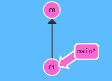

> 一个具有动画演示的学习git命令的网站：https://learngitbranching.js.org/?locale=zh_CN

  目录
- [基础篇](#基础篇)
	- [Git Commit](#Git Commit)
	- [Git Branch](#Git Branch)
	- [Git Merge](#Git Merge)
	- [Git Rebase](#Git Rebase)
- [高级篇](#高级篇)
  - [分离HEAD](#分离HEAD)
  - [相对引用](#相对引用)
  - [撤销变更](#撤销变更)
- [远程仓库](#远程仓库)
  - [Git Fetch](#Git Fetch)
  - [Git Pull](#Git Pull)
  - [制造远程仓库变更](#制造远程仓库变更)
  - [Git Push](#Git Push)
  - [目录偏离](#目录偏离)
  - [main锁定](#main锁定)


## 基础篇

### Git Commit




<center class="half">
    
    
</center>


```git
git commit
git commit
```


### Git Branch

<center class="half">
    
    
</center>


```git
git branch bugFix
git checkout bugFix
```


### Git Merge

一种分支合并的方法。不会移动之前的工作，创建新的合并提交。

<center class="half">
    
    
</center>


```git
git branch bugFix
git checkout bugFix
git commit
git checkout main
git commit
git merge bugFix
```


### Git Rebase

一种分支合并的方法。`Rebase`是取出一系列的提交记录，“复制”它们，然后在另外一个地方逐个的放下去。

<center class="third">
    
    
    
</center>


```git
git branch bugFix
git checkout bugFix
git commit
git checkout main
git commit
git checkout bugFix
git rebase main

git checkout main
git rebase bugFix 
```


## 高级篇

### 分离HEAD

`head`总是指向当前分支上最近一次提交记录。

<center class="half">
    
    
</center>


```git
git checkout C4
```


### 相对引用

`^`表示父提交，`~3`表示第`3`级父提交。

<center class="half">
    
    
</center>


```git
git checkout C4^
```

<center class="half">
    
    
</center>


```git
git checkout C6
git branch -f main HEAD
git checkout C1
git branch -f bugFix HEAD^
```

-f表示强制移动


### 撤销变更

+ git reset：适用于单人使用的本地分支
+ git revert：适用于多人使用的远程分支，可以撤销更改并分享给别人

<center class="half">
    
    
</center>


`C2'`引入了更改，是用来撤销`C2`这个提交的，`C2'`状态与`C1`相同。

```git
git reset local~1
git checkout pushed
git revert pushed
```


## 远程仓库

### Git Fetch

将远程仓库更新的数据下载了下来，但并没有修改本地的文件。

<center class="half">
    
    
</center>


```git
git fetch
```


### Git Pull

`pull = fetch + merge`

`pull --rebase = fetch + rebase`

<center class="half">
    
    
</center>
```git
git pull
```


### 制造远程仓库的变更

<center class="half">
    
    
</center>


假设 `git fakeTeamwork`是在远程仓库的main分支上做一次提交。

```git
git clone
git fakeTeamwork
git fakeTeamwork
git commit
git fetch
git merge o/main
```


### Git Push

<center class="half">
    
    
</center>


```git
git commit
git commit
git push
```


### 目录偏离

情景大概就是远程仓库修改了，然后本地也做了修改，如何进行统一？直接`push`是不行的。

我们用 `git fetch` 更新了本地仓库中的远程分支，然后用` rebase `将我们的工作移动到最新的提交记录下，最后再用 `git push` 推送到远程仓库。 

<center class="half">
    
    
</center>


```git
git clone
git fakeTeamwork
git commit
git pull --rebase
git push
```


### main锁定

在合作团队中工作时，`main`可能被锁定，需要一些`Pull Request`流程来合并修改。如果提交(`commit`)到本地`main`, 然后试图推送(`push`)修改, 将会收到这样类似的信息: 

`! [远程服务器拒绝] main -> main (TF402455: 不允许推送(push)这个分支; 你必须使用pull request来更新这个分支.)`

新建一个分支`feature`, 推送到远程服务器. 然后`reset`本地的`main`分支和远程服务器保持一致, 否则下次`pull`并且他人的提交和本地冲突的时候就会有问题. 

<center class="half">
    
    
</center>


